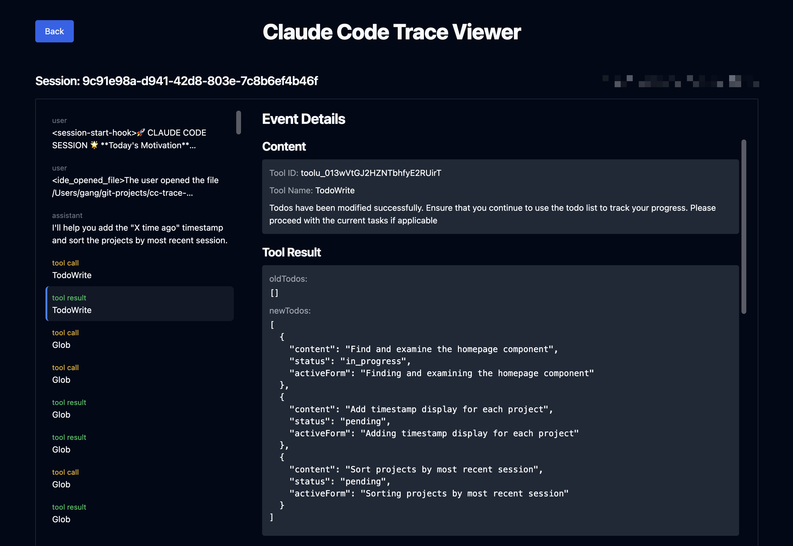

# Claude Code Trace Viewer

A web-based viewer for Claude Code session traces, built with FastHTML and MonsterUI.



## Features

- 📁 **Auto-detects your Claude Code sessions** from `~/.claude/projects/`
- 🕐 **Accurate timezone handling** - Automatically converts UTC timestamps to your local time
- 🎯 **Session filtering** - Only shows real conversations, hides summary-only sessions
- 🌲 **Flat timeline view** - Easy-to-read chronological event display
- 🎨 **Interactive UI** - Hover and selection states for better navigation
- ⏱️ **Relative timestamps** - Shows "2 hours ago", "3 days ago", etc.

## Quick Start

### Prerequisites

- Python 3.11 or higher
- [uv](https://github.com/astral-sh/uv) package manager (recommended)

### Installation & Setup

1. **Clone the repository:**
```bash
git clone https://github.com/d-gangz/cc-trace-viewer.git
cd cc-trace-viewer
```

2. **Install dependencies** (choose one method):

**Option A: Using uv (Recommended)**
```bash
# Install dependencies from pyproject.toml
uv sync
```

**Option B: Using pip**
```bash
# Install the package with dependencies from pyproject.toml
pip install -e .
```

### Running the Application

**With uv (Recommended):**
```bash
uv run python main.py
```

**With python directly:**
```bash
python main.py
```

**What happens when you run it:**
1. ✅ Auto-detects your Claude Code sessions from `~/.claude/projects/`
2. ✅ Starts a local web server at http://localhost:5001
3. ✅ Opens in your browser automatically

**Access the viewer:** http://localhost:5001

### What's in pyproject.toml?

All dependencies are managed in `pyproject.toml`:
- **python-fasthtml** - Modern Python web framework
- **monsterui** - UI components for FastHTML
- **python-dateutil** - Timezone-aware datetime parsing

No manual dependency installation needed - both `uv sync` and `pip install -e .` read from `pyproject.toml` automatically!

## How It Works

The viewer:
- Discovers all JSONL session files in your `~/.claude/projects/` directory
- Parses session events and builds a timeline view
- Groups sessions by project
- Shows the most recently active sessions first
- Converts UTC timestamps to your local timezone automatically
- Filters out incomplete sessions (summary-only sessions without actual conversation)

## Project Structure

```
cc-trace-viewer/
├── main.py           # Main application code
├── pyproject.toml    # Project dependencies and metadata
├── uv.lock          # Locked dependencies
└── README.md        # This file
```

## Dependencies

All dependencies are automatically installed from `pyproject.toml`:

- **python-fasthtml** (>=0.12.29) - Modern Python web framework
- **monsterui** (>=1.0.29) - UI components for FastHTML
- **python-dateutil** (>=2.9.0) - Timezone-aware datetime parsing

Simply run `uv sync` or `pip install -e .` and you're ready to go!

## Contributing

Contributions are welcome! Please feel free to submit a Pull Request.

## License

MIT License - feel free to use this for your own projects!

## Troubleshooting

### No sessions showing up?

Make sure:
1. You have Claude Code installed and have created some sessions
2. Your sessions are stored in `~/.claude/projects/`
3. The session files are not empty or summary-only

### Timestamps showing wrong time?

The app automatically converts UTC to your local timezone. If times seem off:
1. Check your system timezone is set correctly
2. Restart the application after changing system timezone

### Port 5001 already in use?

You can change the port in `main.py` by modifying the `serve()` call at the bottom of the file.
